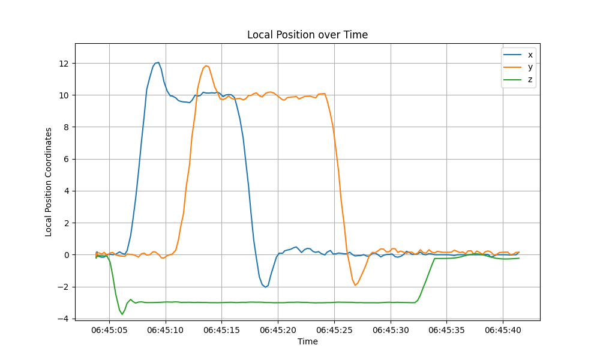
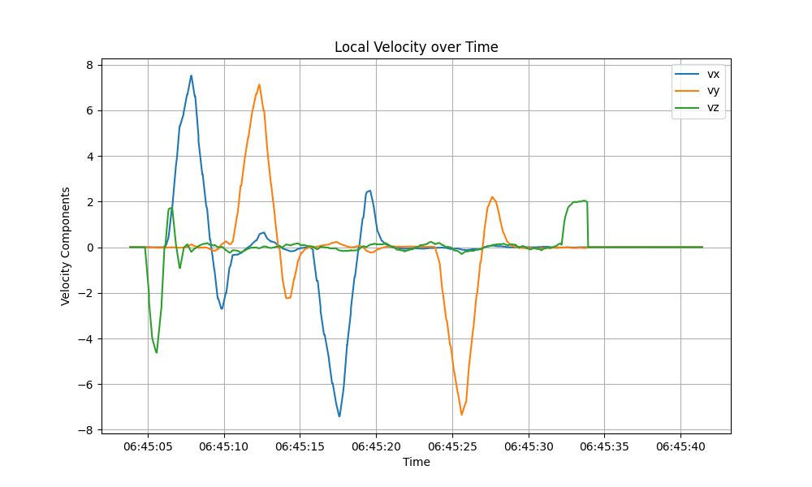
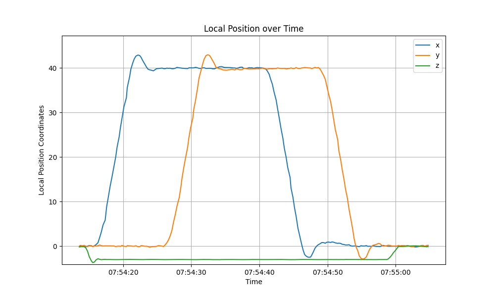
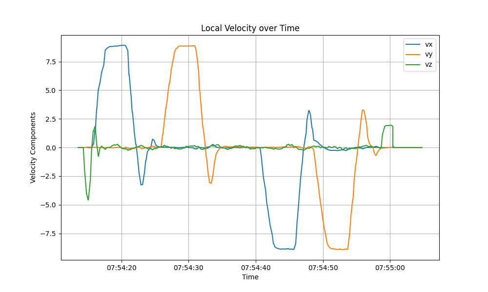

# Backyard Flyer Project

## Introduction
This project is about controlling a drone to complete its mission autonomously in the guided mode using the drone simulator developed in Unity. The "lifecycle" of a flight plan is represented with a finite state machine comprising of all state transistions. The script implements a simple flight plan to fly in a square box path by commanding positions from the waypoints specified.

[](https://www.youtube.com/watch?v=4aPVUBKM0Xs "Click to Watch!")

## Setup
- Cloned the repo https://github.com/udacity/FCND-Term1-Starter-Kit.git and installed the dependencies.
- Download the Unity simulator from https://github.com/udacity/FCND-Simulator-Releases/releases for MacOS.
- Cloned the repo https://github.com/udacity/FCND-Backyard-Flyer.git and updated code in `backyard_flyer.py`

## Tasks
- Filled in the state transition methods for Drone class: arming_transition(), takeoff_transition(), waypoint_transition(), landing_transition(), and disarming_transition().
- Filled in the appropriate callbacks.
- Implemented custom logging and plotting scripts. I also tried real time logging using visdom.
- Opened the Unity Simulator and selected "Backyard Flyer" option.
- Executed the updated `backyard_flyer.py` script.
- Optionally, I tried to limit the max velocity to reduce the over and under shoot by clipping the local velcoity and trying cmd_velocity. But it didn't work.

```
(fcnd) (base) ➜  FCND-Backyard-Flyer git:(master) ✗ python backyard_flyer.py
Logs/TLog.txt
Creating log file
Logs/NavLog.txt
starting connection
arming transition
takeoff transition
Takeoff Coordinates: Latitude = -122.3957522, Longitude = 37.7932818, Altitude = 0.124
setting waypoints
waypoint transition
target_position [10.0, 0.0, 3.0]
waypoint transition
target_position [10.0, 10.0, 3.0]
waypoint transition
target_position [0.0, 10.0, 3.0]
waypoint transition
target_position [0.0, 0.0, 3.0]
landing transition
Landing Coordinates: Latitude = -122.3957514, Longitude = 37.7932821, Altitude = 2.995
disarm transition
manual transition
```

## Observations
The drone takes off from the home location (-122.3957522,37.7932818) and flies in a square shape. The size of each side of the square is set as 10m and altitude as 3m. This is specified in the `calculate_box` function as 4 sequential waypoints`[[10.0, 0.0, 3.0], [10.0, 10.0, 3.0], [0.0, 10.0, 3.0], [0.0, 0.0, 3.0]]`. It finally lands at the location (-122.3957514, 37.7932821). The distance between the take-off and landing points is approximately 0.078 meters. This is a very short distance, indicating that the drone has landed extremely close to the take-off point.

Local Position - 10m

The plot clearly shows that the drone does not stop precisely at the predetermined waypoints. Rather than halting at the intended 10 meters, there is a noticeable overshoot to approximately 12 meters. Subsequently, the drone attempts to correct this deviation, initially undershooting below 10 meters, before finally stabilizing at the exact 10-meter mark. This pattern of overshooting and then correcting is consistent in both the x and y directions. Regarding altitude, the drone initially exceeds the target by nearly 1 meter (peaking at about 4 meters), before it settles at the designated 3 meters.

Local Velocity - 10m

From the velocity graph, it is evident that the drone's speed increases steadily as it approaches each waypoint. Specifically, the speed peaks at nearly 8 meters per second in both the x and y directions. To correct for the initial overshoot, the drone reverses direction, resulting in a negative velocity, before it eventually stabilizes at 0 meters per second as it aligns precisely with the waypoint. During the takeoff transition, the velocity ascends to 4 meters per second, indicating a brisk ascent, and during landing, the velocity moderates to 2 meters per second, ensuring a controlled descent.

Local Position - 40m


Local Velocity - 40m


The provided plots display the drone's local velocity and position over time during a 40-meter square box flight pattern. Notably, the velocity peaks at 8 m/s, which aligns with the drone's rapid movement between waypoints. The graphs show that while the velocity reaches high levels, the oscillations or fluctuations in velocity are relatively subdued compared to other tests. This indicates a smoother transition between points.

In this specific instance of the BackyardFlyer script, the drone's movements are primarily controlled through position commands in the `waypoint_transition` function. There is no direct manipulation of other flight dynamics such as velocity or thrust within this function. The drone's position commands implementations are done in the [drone.py](https://github.com/udacity/udacidrone/blob/master/udacidrone/drone.py) and [mavlink_connection.py](https://github.com/udacity/udacidrone/blob/master/udacidrone/connection/mavlink_connection.py) scripts to autonomously manage these aspects based on the positional inputs. It is not directly clear as to what changes are required since I couldn't find any implementations of a cascaded PID controller, where the outerloop is a position controller and the inner loop is a velocity controller.

## Conclusion
These observations suggest that while the drone is capable of reaching and adjusting its position relative to specific waypoints, there is a need for more precise control mechanisms to mitigate overshooting and stabilize more quickly at the desired positions and velocities. Adjusting the flight control algorithms to dampen excessive velocity changes and fine-tuning the response characteristics may result in smoother transitions and more accurate waypoint navigation.