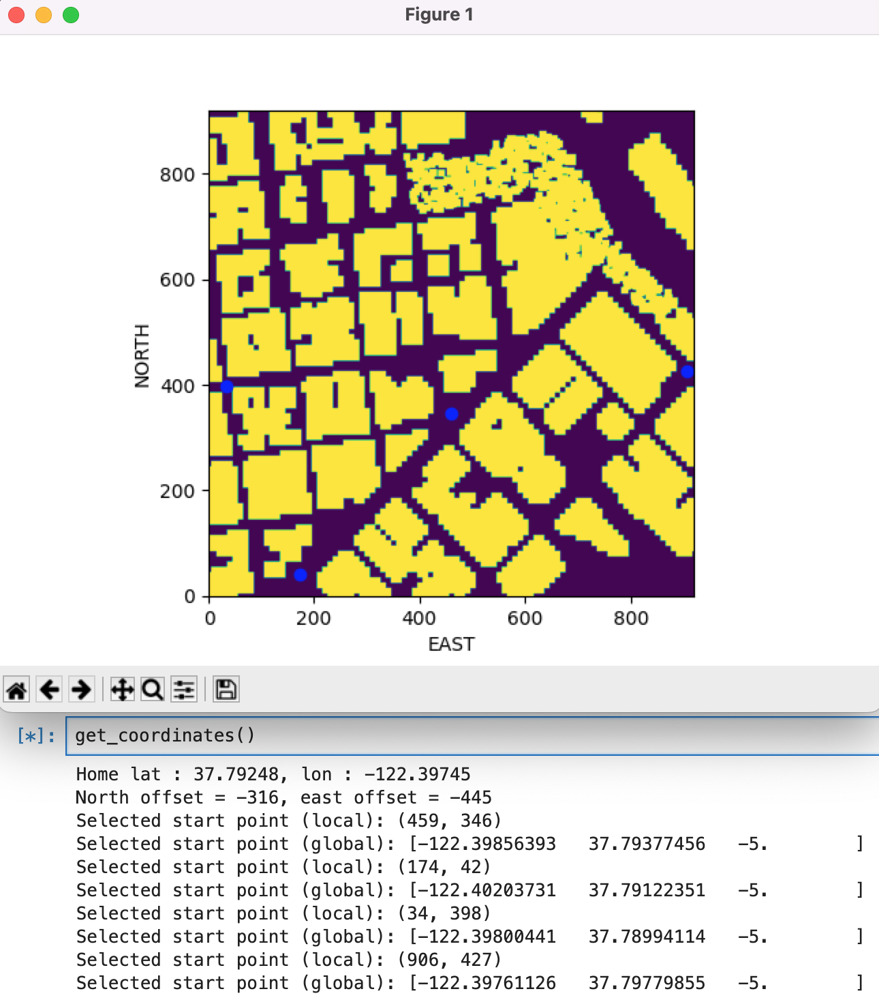
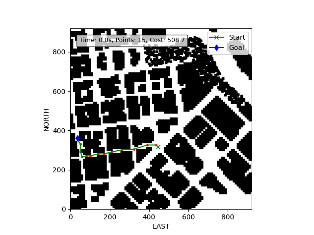
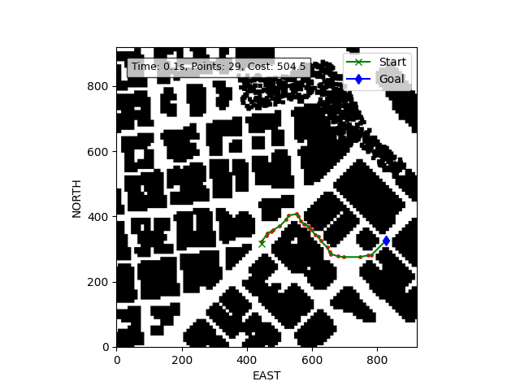
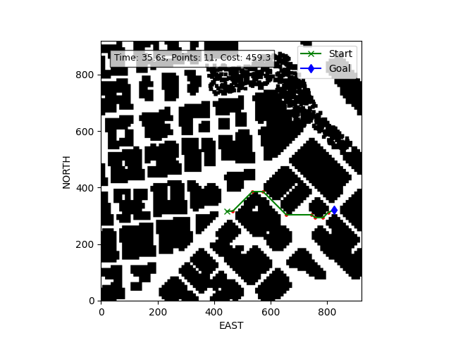
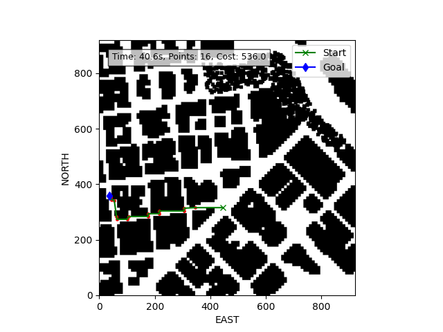
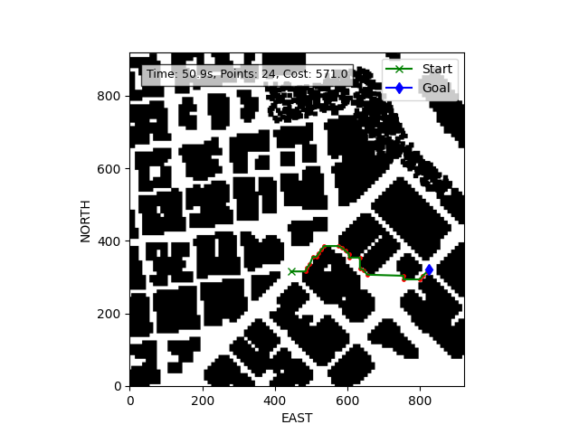

# 3D Motion Planning Project

## Introduction
This is the second project on [Udacity's Flying Car Nanodegree](https://www.udacity.com/course/flying-car-nanodegree--nd787). It consists of planning and executing a trajectory of a drone in an urban environment. Built on top of the event-based strategy utilized on the first project, the complexity of path planning in a 3D environment is explored. The code communicates with [Udacity FCND Simulator](https://github.com/udacity/FCND-Simulator-Releases/releases) using [Udacidrone API](https://udacity.github.io/udacidrone/).

**Videos of the drones flying in the simulator**

Graph Search - Position 1
[](https://www.youtube.com/watch?v=vlAzG_rSU-g "Click to Watch!")

Graph Search - Position 2
[](https://www.youtube.com/watch?v=pdO3FRy-PEI "Click to Watch!")

Grid Search - Position 1
[](https://www.youtube.com/watch?v=jnOa_vdNLww "Click to Watch!")

Grid Search - Position 2
[](https://www.youtube.com/watch?v=l6YtGpOTaEw "Click to Watch!")

## Setup
- Cloned the repo https://github.com/udacity/FCND-Motion-Planning
- The [Unity simulator](https://github.com/udacity/FCND-Simulator-Releases/releases) and [Udacidrone API](https://github.com/udacity/udacidrone) were setup in the previous project
- The environment setup and the dependencies were installed in the previous project

## Tasks
- Tested that motion_planning.py is a modified version of backyard_flyer_solution.py for simple path planning.
- Updated the `planning_utils.py` and `motion_planning.py` scripts with the following changes.
    - Modified code to read the global home location from the first line of the colliders.csv file and set that position as global home.
    - Retrieved current position in geodetic coordinates from self._latitude, self._longitude and self._altitude. Then used the utility function global_to_local() to convert to local position.
    - Updated start point for planning from map_centre to current local position.
    - Modified goal position. Used two different goal locations for different iterations.
    - Completed the search algorithm. Added diagonal motions to the A* implementation provided, and assigned them a cost of sqrt(2).
    - Culled waypoints from the path determined using search.
    - Integrated both grid and graph based search algorithms in the same script. The specific mode can be selected using the script arg params.

## Execution

Run the motion_planning.py script and specify the arguments for mode (grid/graph search), allow_diagonal, pruning and target coordinates

```
(fcnd) (base) ➜  FCND-Motion-Planning python motion_planning.py --mode 1 --allow_diagonal 1 --prune 1 --target -122.4021033 37.79290028 -0.147
Logs/TLog.txt
Logs/NavLog.txt
starting connection
arming transition

Loading map data from file ... 
Done ✅

current global home: north = -122.40, east = 37.79, down = 143.04

Creating Graph ... 
Elapsed time: 39.7 seconds
Done ✅

North offset = -316, east offset = -445
Local Start and Goal:  (315.76114, 445.76846) (360.76114, 35.76850000000002)

Searching for path ... 
Found a path.
Elapsed time: 0.0 seconds
Length of path: 57
Done ✅

Pruning path ...
Length of pruned path: 34
Done ✅

Length of waypoints: 34
Sending waypoints to simulator ...
takeoff transition
waypoint transition
target position [0, 1, 4, 0]
waypoint transition
target position [8, 1, 4, 0]
waypoint transition
target position [10, -9, 4, 0]
waypoint transition
target position [10, -54, 4, 0]
waypoint transition
target position [8, -64, 4, 0]
waypoint transition
target position [3, -74, 4, 0]
waypoint transition
target position [0, -84, 4, 0]
waypoint transition
target position [0, -91, 4, 0]
waypoint transition
target position [-1, -94, 4, 0]
waypoint transition
target position [-11, -122, 4, 0]
waypoint transition
target position [-9, -125, 4, 0]
waypoint transition
target position [-15, -144, 4, 0]
waypoint transition
target position [-15, -184, 4, 0]
waypoint transition
target position [-20, -196, 4, 0]
waypoint transition
target position [-20, -221, 4, 0]
waypoint transition
target position [-25, -234, 4, 0]
waypoint transition
target position [-25, -244, 4, 0]
waypoint transition
target position [-35, -274, 4, 0]
waypoint transition
target position [-35, -304, 4, 0]
waypoint transition
target position [-40, -316, 4, 0]
waypoint transition
target position [-40, -324, 4, 0]
waypoint transition
target position [-38, -329, 4, 0]
waypoint transition
target position [-41, -334, 4, 0]
waypoint transition
target position [-45, -344, 4, 0]
waypoint transition
target position [-45, -364, 4, 0]
waypoint transition
target position [-50, -379, 4, 0]
waypoint transition
target position [-50, -385, 4, 0]
waypoint transition
target position [-39, -388, 4, 0]
waypoint transition
target position [-35, -390, 4, 0]
waypoint transition
target position [-25, -394, 4, 0]
waypoint transition
target position [0, -394, 4, 0]
waypoint transition
target position [15, -394, 4, 0]
waypoint transition
target position [38, -409, 4, 0]
waypoint transition
target position [45, -409, 4, 0]
landing transition
disarm transition
manual transition
```

## Project Rubric

**Explain the Starter Code**
Test that motion_planning.py is a modified version of backyard_flyer_solution.py for simple path planning. Verify that both scripts work. Then, compare them side by side and describe in words how each of the modifications implemented in motion_planning.py is functioning.

The `motion_planning.py` script represents an evolution of the `backyard_flyer_solution.py`, introducing sophisticated path planning capabilities. The key difference lies in the addition of a `PLANNING` state, where the script calculates a flight path using A* search algorithm before the drone takes off. This stage is critical for navigating through environments with obstacles, making the flight not only automated but also safer and more efficient.

In the `plan_path` method of `motion_planning.py`, the script first converts the drone's current global position to local coordinates. It then retrieves obstacle data from a pre-defined file to create a 2D grid representation of the environment using the `create_grid` function from `planning_utils.py`. This grid marks obstacles as `1` (indicating no-fly zones) and free spaces as `0`, taking into account the drone's altitude and a safety margin around obstacles.

The A* search algorithm, implemented in `planning_utils.py`, is then invoked to find the shortest path from the drone's start position to a goal position, factoring in possible movements in four directions (north, south, east, west) at a fixed altitude. The result is a list of waypoints, which are subsequently converted into drone commands to navigate through the waypoints.

**Implementing the Path Planning Algorithm**
1. In the starter code, we assume that the home position is where the drone first initializes, but in reality you need to be able to start planning from anywhere. Modify your code to read the global home location from the first line of the colliders.csv file and set that position as global home (self.set_home_position())
Here you should read the first line of the csv file, extract lat0 and lon0 as floating point values and use the self.set_home_position() method to set global home.

```
header = open('colliders.csv').readline()
s = re.findall(r"[-+]?\d*\.\d+|\d+", header)
lat0 = float(s[1])
lon0 = float(s[3])
self.set_home_position(lon0, lat0, 0)        
```

2. In the starter code, we assume the drone takes off from map center, but you'll need to be able to takeoff from anywhere. Retrieve your current position in geodetic coordinates from self._latitude, self._longitude and self._altitude. Then use the utility function global_to_local() to convert to local position (using self.global_home as well, which you just set) Here as long as you successfully determine your local position relative to global home you'll be all set.

```
print("current global home: north = %.2f, east = %0.2f, down = %0.2f"(
                self.global_position[0],
                self.global_position[1],
                self.global_position[2]))
local_north, local_east, local_down = global_to_local(
            self.global_position, self.global_home)
```

3. In the starter code, the start point for planning is hardcoded as map center. Change this to be your current local position.
This is another step in adding flexibility to the start location. As long as it works you're good to go!

```
grid_start = (
            int(np.ceil(local_north - north_offset)),
            int(np.ceil(local_east - east_offset))
        )
```
The offsets can be calculated using the `create_grid` or`create_graph` methods.

4. In the starter code, the goal position is hardcoded as some location 10 m north and 10 m east of map center. Modify this to be set as some arbitrary position on the grid given any geodetic coordinates (latitude, longitude)
This step is to add flexibility to the desired goal location. Should be able to choose any (lat, lon) within the map and have it rendered to a goal location on the grid.

```
goal_north, goal_east, goal_alt = global_to_local(
            self.global_goal_position, self.global_home
        )
```
The `global_goal_position` is an input argument provided to the script, consisting of the target's latitude, longitude, and altitude (lat, lon, alt). To facilitate the selection of precise points within the free space, the `get_global_position.ipynb` notebook includes helper code that enables interaction with the map to obtain both local and global coordinates. This feature significantly simplifies the process of choosing points on the map, eliminating the need for guesswork and ensuring more accurate navigation and planning.



5. Write your search algorithm. Minimum requirement here is to add diagonal motions to the A* implementation provided, and assign them a cost of sqrt(2). However, you're encouraged to get creative and try other methods from the lessons and beyond! In your writeup, explain the code you used to accomplish this step.

The planning_utils.py script encapsulates functions pivotal for facilitating the A* algorithm's deployment in both grid and graph-based spatial domains, showcasing an intricate blend of heuristic-driven search optimization and pathfinding precision. Central to the A* algorithm's efficacy is its heuristic function, which estimates the cost to reach the goal from a given node, thereby synergizing the exhaustive nature of Dijkstra's algorithm with the heuristic-guided expediency of Greedy Best-First-Search. This heuristic component is critical for steering the search process towards the goal, effectively minimizing the exploration of less promising paths and thus enhancing computational efficiency.

In grid-based applications, the A* algorithm meticulously navigates through a discretized spatial matrix, identifying the most cost-effective path by evaluating the cumulative cost from the start node combined with the heuristic estimate to the goal for each traversed cell. Contrastingly, within graph-based contexts, the algorithm abstracts the environment into a network of interconnected nodes, each representing possible waypoints or positions in the space, with edges denoting the available paths and their associated costs.

Incorporating the A* algorithm's versatility and adaptability for pathfinding tasks, the `planning_utils.py` script is engineered to cater to diverse operational contexts through the provision of three configurable input arguments. These arguments enable users to tailor the search algorithm's behavior to specific requirements, thus optimizing the pathfinding process across both grid and graph-based environments.

a. `--mode`: This parameter allows users to select the operational context of the A* algorithm. Setting `--mode` to `0` initiates a grid-based search, wherein the algorithm traverses a discretized spatial grid, navigating obstacles and seeking the shortest path between points. Conversely, selecting `1` switches to a graph-based search mode, where the environment is abstracted into a graph of nodes and edges, facilitating pathfinding across potentially complex networks.

b. `--allow_diagonal`: This configuration option dictates the movement capabilities of the agent within a grid environment. When set to `0`, the agent is restricted to orthogonal movements (up, down, left, right), reflecting a more constrained navigational model. Altering this parameter to `1` permits diagonal movements, thereby expanding the potential paths the agent can take and potentially reducing the overall path length.

c. `--prune`: The inclusion of the `--prune` parameter underscores the script's capability to refine the generated path post-calculation. Activating this feature (`--prune` set to `1`) triggers the pruning process, which systematically eliminates unnecessary or inefficient segments from the discovered path, resulting in a more streamlined and direct route to the goal.

These configurable parameters underscore the script's robustness and flexibility, enabling users to fine-tune the A* algorithm's implementation according to the specific characteristics of the environment and the requirements of the pathfinding task.

6. Cull waypoints from the path you determine using search.
For this step you can use a collinearity test or ray tracing method like Bresenham. The idea is simply to prune your path of unnecessary waypoints. In your writeup, explain the code you used to accomplish this step.

The prune_path function is designed to optimize a given path by removing unnecessary waypoints, thus simplifying the path without altering its overall direction. This pruning process is particularly useful in pathfinding algorithms where the initial path may include redundant points that contribute to inefficiency and increased complexity. The function takes two arguments: path, a list of waypoints that describe the route, and epsilon, a threshold value used to determine the tolerance for collinearity detection, with a default value set to 1e-1.

Internally, the function defines two helper functions, point and collinearity_check. The point function is used to augment a 2D coordinate with a homogeneous coordinate, transforming it into a 3D point. This is necessary for the collinearity check, which involves calculating the determinant of a matrix composed of three points. The collinearity_check function evaluates whether three points are collinear by creating a matrix from these points and calculating its determinant. If the absolute value of the determinant is less than the specified epsilon, the points are considered collinear.

The core of the function iterates through the provided path, checking for collinearity between consecutive triplets of points. If a set of three points is found to be collinear, the middle point is deemed unnecessary and is removed from the path. This process continues until all such redundant points are eliminated, resulting in a pruned path that maintains the overall trajectory while reducing the number of waypoints.

## Executing the flight
I had selected two target positions - Postion 1 (-122.4021033, 37.79290028, -0.147) and Position 2 (-122.39314514, 37.79251198, -0.147). I've included the details in the `run_motion_planning.sh` script for the different modes and positions.

Here are some examples of trajectories found with this code:

Graph - Position 1

Graph - Position 2

Grid + diagonal - Position 1

Grid + diagonal - Position 2

Grid - Position 1

Grid - Position 2


## Observations

- **Epsilon Parameter Adjustment for Path Pruning**: I observed that adjusting the epsilon parameter was crucial for optimizing the pruning of points along the path. For extended straight paths, a higher epsilon value was necessary to effectively prune the path, whereas, for paths with frequent bends or turns, a lower epsilon value proved more effective. This adjustment ensured that the path remained efficient and aligned with the terrain's natural contours.

- **Efficiency of Diagonal movements in Grid Search**: Additionally, while enabling diagonal search resulted in quicker path discovery, I noticed that the paths tended to exhibit more zig-zag patterns compared to when only lateral (side-to-side) movements were allowed. This observation suggests a trade-off between the efficiency of path length and the smoothness of the trajectory.
  
- **Waypoints Simulation in Graph Search Method Challenges**: The simulation of waypoints encountered difficulties when applied to the graph-based method, potentially due to the handling of larger floating-point numbers. A workaround involved rounding up the waypoints (using the `ceil` function) prior to their transmission to the simulator. This adjustment, while mitigating the issue, resulted in the zig-zag movement observed in the videos of graph-based paths. Despite this, graph-based paths generally offer more realistic and feasible routing options compared to grid-based alternatives.

- **Computational Efficiency of Graph-Based Methods**: Graph-based pathfinding methods demonstrated a faster computation time in comparison to grid-based methods. This efficiency is attributable to the graph-based approach's ability to abstract and navigate the environment more effectively, reducing the computational overhead associated with the dense, discrete representation used in grid-based methods.

- **TCP Connection Errors in Grid-Based Methods**: During the implementation of grid-based methods, I encountered TCP connection errors whenever the execution time exceeded 60 seconds. Attempts to mitigate this issue by adjusting the `timeout` parameter in the `MavlinkConnection` were unsuccessful. Consequently, it became necessary to limit the scope of the simulation to shorter paths to avoid these connectivity issues.

- **Longer Execution Duration for Grid Search**: My observations revealed that the grid-based search executed through this script exhibited a notably prolonged duration to identify a path, as opposed to its performance when run independently in a notebook environment. This discrepancy in execution time leads me to theorize that the increased latency may be attributed to the Udacidrone API, which could be intermittently pausing the process to monitor for alterations in the drone's state via the state callback function.