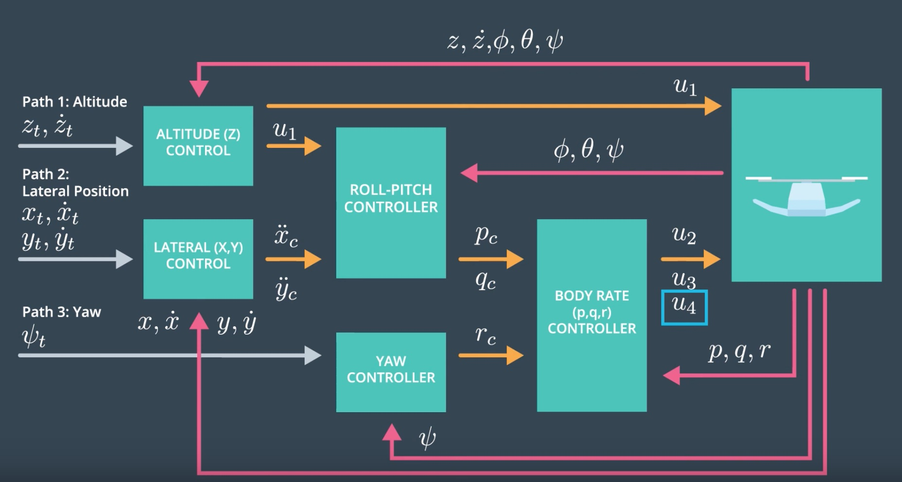

# 3D Quadcopter Controls Project

## Introduction
The objective of this project is to develop and implement a 3D flight controller for a quadcopter. Given the mission-critical nature of flight control systems, C or C++ is used for its performance and reliability. In this project, we will build and incrementally tune a flight controller in C++. This process will involve implementing the controller in distinct stages, each requiring careful tuning and testing to ensure optimal performance and stability of the quadcopter.

3D Quadcopter Controller

**Video of simulations**

The logic flow of the simulation is as follows:
- Retrieve the next trajectory point `curTrajPoint` the vehicle should follow based on the current simulation time. This point includes desired position, velocity, acceleration, and possibly attitude.
- Altitude Control: Compute the collective thrust command `collThrustCmd` necessary to maintain or move to the desired altitude `curTrajPoint.position.z` and vertical speed `curTrajPoint.velocity.z`.
- Lateral Position Control: Compute the desired lateral acceleration `desAcc` to guide the quadcopter to the desired XY position and velocity.
- Roll and Pitch Control: Computes desired angular rates `desOmega` in the roll and pitch axes based on the desired lateral acceleration, estimated attitude, and the collective thrust command.
- Yaw Control: Adjust the yaw component of `desOmega` using a yaw control function, which aims to align the quadcopter’s yaw with that of the current trajectory point.
- Body Rate Control: Compute the necessary moments (torques) to achieve the desired angular rates `desOmega`, considering the estimated angular rates `estOmega`.
- Generate Motor Commands: Generate the final motor commands based on the collective thrust and desired moments. These commands are then used to adjust individual motor speeds to control the vehicle's attitude and position.

## Setup
- Cloned the repo https://github.com/udacity/FCND-Controls-CPP.git
- Set up the C++ simulator and the development environment
- XCode  
   - Download and installed XCode from the App Store
   - Opened the project from the <simulator>/project directory
   - Set working directory to $PROJECT_DIR and check ‘use custom working directory’, under (Project Name) | Edit Scheme > under Run/Debug > under the Options tab.
   - Compiled and ran the project
- Simulator:
   - The simulator was developed in C++ by Fotokite. In the simulator window you can right click the window to select between a set of different scenarios that are designed to test the different parts of the controller. Each scenario is configured to load certain graphs as per the task. But, there is an option to add other data to two different graph plots. You can also use the toggle option to visualize the actual & reference trajectories and thrust vectors.
- Code
   - Updated the code in `src/QuadControl.cpp` and  `QuadControlParams.txt`. The `src/QuadControl.cpp` file contains all the code for the controller. `QuadControlParams.txt` has all the control gains and other desired tuning parameters. The simulation reads the config file every iterations and the parameters can be updated in realtime without requiring to recompile the project. All the configuration files for the controller and the vehicle are in the `config` directory.
   - The default values for these parameters are all too small by a factor of somewhere between about 2X and 4X. Also, The ratio of `kpV / kpP` should be 4. For a critically damped double integrator system, the derivation for this ratio is available in this [one-page document](https://www.overleaf.com/read/bgrkghpggnyc#/61023787/)

## The Tasks

Implemented the following controls in C++:
- **body rate control**:
   - The controller is a proportional controller on body rates to commanded moments. The controller takes into account the moments of inertia of the drone when calculating the commanded moments.
- **roll pitch control**:
   - The controller uses the acceleration and thrust commands, in addition to the vehicle attitude to output a body rate command. The controller accounts for the non-linear transformation from local accelerations to body rates. The drone's mass is accounted for when calculating the target angles. The rotation matrix R transforms vectors between the inertial (earth) frame and the body frame of the quadcopter.
- **altitude controller**:
   - The controller uses both the down position and the down velocity to command thrust. The thrust includes the non-linear effects from non-zero roll/pitch angles.
   - Additionally, the C++ altitude controller contains an integrator to handle the weight non-idealities presented in scenario 4.
- **lateral position control**:
   - The controller uses the local NE position and velocity to generate a commanded local acceleration.
- **yaw control**:
   - The controller is a linear/proportional heading controller to yaw rate commands (non-linear transformation not considered).
- **motor commands**:
   - The thrust and moments are converted to the appropriate 4 different desired thrust forces for the moments. The dimensions of the drone are accounted for when calculating thrust from moments.

## Flight Evaluation
### Scenario 1 - Intro

In this scenario, there is quad that is falling down. The objective is to stabilise the quad by tuning the `mass` param to counter the gravity. The controller is turned off in this scenario by setting all gain parameters to zero.

It was observed that the quad falls down when mass <= 0.4 and flies above when mass >= 0.5. So the required mass was tuned iteratively to a value of 0.4845 to make the quad hover at the set point (0,0,-1).

Result: 
- PASS: ABS(Quad.PosFollowErr) was less than 0.500000 for at least 0.800000 seconds

### Scenario 2 - Body rate and roll/pitch control

This scenario has a quad above the origin at (0,0,-1).  It is created with a small initial rotation speed about its roll axis (Quad.InitialOmega=30,0,0). The controller will need to stabilize the rotational motion and bring the vehicle back to level attitude.

- Tuned `kpBank` in `QuadControlParams.txt` to minimize settling time but avoid too much overshoot. This is the proportional gain for the roll and pitch angle controllers. It determines how aggressively the drone will try to correct deviations from the desired roll and pitch angles.
- Tuned `kpPQR` in `QuadControlParams.txt` to get the vehicle to stop spinning quickly but not overshoot. This represents the proportional gains for the roll rate (P), pitch rate (Q), and yaw rate (R). These parameters control how quickly the drone reacts to changes in roll, pitch, and yaw rates.

This was the methodology followed for incremental adjustments:
   - Initial values given are kpBank = 5 and kpPQR = (23, 23, 5). So the target values should be within the 2-4x range kpBank = [10,20] and kpPQR = [(46, 46, 10), (92,92,20)]
   - Increase `kpBank` if the drone is too sluggish in responding to roll and pitch commands.
   - Reduce `kpBank` if the drone oscillates or feels too "twitchy".
   - Increase `kpPQR` the values if the response to angular rate changes is too slow.
   - Decrease `kpPQR` if there's too much oscillation or instability in the drone's motion.

The final selected values for `kpBank` is 14 and `kpPQR` is (50,50,20)

Result: 
- PASS: ABS(Quad.Roll) roll was less than 0.025000 radian for at least 0.750000 seconds
- PASS: ABS(Quad.Omega.X) roll rate was less than 2.500000 radian/sec for at least 0.750000 seconds

### Scenario 3 - Position/velocity and yaw angle control

This scenario is to test the position, altitude and yaw control for the quad. This scenario has 2 identical quads, one offset from its target point (initialized with yaw = 0 degrees) and second offset from target point (initialized with yaw = 45 degrees).

- Tuned parameters `kpPosXY` and `kpPosZ`
- Tuned parameters `kpVelXY` and `kpVelZ`
- Tuned parameters `kpYaw` and the 3rd (z) component of `kpPQR`

This was the methodology followed for incremental adjustments:
   - Initial values given are kpPosXY = 1, kpPosZ = 1 and kpYaw = 1. So the target values should be within the 2-4x range for kpPosXY, kpPosZ and kpYaw in the range [2,4].
   - For a second order system, the velocity gain (`kpVelXY` and `kpVelZ`) should be at least ~3-4 times greater than the respective position gain (`kpPosXY` and `kpPosZ`). So the target values should be within the 3-4x range kpVelXY = [6,16] and kpVelZ = [c]
   - Tuned position control for settling time. Did’t try to tune yaw control too tightly, as yaw control requires a lot of control authority from a quadcopter and can really affect other degrees of freedom.

The final selected values for `kpPosXY` is 3 and `kpPosZ` is 4. Applied a 3x multipler for velocity values `kpVelXY` is 9, `kpVelZ` is 12. Made slight adjustments for `kpYaw` = 2.

Result: 
- PASS: ABS(Quad1.Pos.X) was less than 0.100000 for at least 1.250000 seconds
- PASS: ABS(Quad2.Pos.X) was less than 0.100000 for at least 1.250000 seconds
- PASS: ABS(Quad1.Yaw) was less than 0.100000 for at least 1.000000 seconds
- PASS: ABS(Quad2.Yaw) was less than 0.100000 for at least 1.000000 seconds

### Scenario 4 - Non-idealities and robustness

This scenario is to test the non-idealities and robustness of the controller. This is a configuration with 3 quads that are all are trying to move one meter forward. However, these quads are all a bit different:
 - The green quad has its center of mass shifted back
 - The orange vehicle is an ideal quad
 - The red vehicle is heavier than usual

Tuned `KiPosZ` the integral control in Altitude controller to help with the different-mass vehicle. The initial value given for `KiPosZ` is 20. So the target value is in the range [40-80]. Final selected value for `KiPosZ` is 40.

Result:
- PASS: ABS(Quad1.PosFollowErr) was less than 0.100000 for at least 1.500000 seconds
- PASS: ABS(Quad2.PosFollowErr) was less than 0.100000 for at least 1.500000 seconds
- PASS: ABS(Quad3.PosFollowErr) was less than 0.100000 for at least 1.500000 seconds

   

### Scenario 5 - Tracking trajectories ###

Now that we have all the working parts of a controller, we can put it all together and test it's performance on a trajectory.  This scenario has two quadcopters:
 - the orange one is following `traj/FigureEight.txt`
 - the other one is following `traj/FigureEightFF.txt`

Result:
- PASS: ABS(Quad2.PosFollowErr) was less than 0.250000 for at least 3.000000 seconds

  

The implemented C++ controller is successfully able to fly the provided test trajectory and visually passes inspection of the scenarios leading up to the test trajectory.

## Extra Challenge 1 (Optional)
Can you figure out a way to generate a trajectory that has velocity (not just position) information?
- Updated the python script `traj/MakePeriodicTrajectory.py` with equations for velocity derieved from position.
- Generated a new FigureEightFF.txt that has velocity terms.

Let's derive the velocity equations based on your position equations:

**Position Equations**:
- \( x(t) = \sin\left(\frac{2\pi t}{T_x} + \phi_x\right) \times R \times A_x + C_x \)
- \( y(t) = \sin\left(\frac{2\pi t}{T_y} + \phi_y\right) \times R \times A_y + C_y \)
- \( z(t) = \sin\left(\frac{2\pi t}{T_z} + \phi_z\right) \times R \times A_z + C_z \)

Where \( T \) is the period, \( \phi \) is the phase, \( R \) is the radius, \( A \) is the amplitude, and \( C \) is the center for each dimension.

**Velocity Equations**:
The velocity can be derived as the first derivative of position.
- \( v_x(t) = \cos\left(\frac{2\pi t}{T_x} + \phi_x\right) \times \left(\frac{2\pi}{T_x}\right) \times R \times A_x \)
- \( v_y(t) = \cos\left(\frac{2\pi t}{T_y} + \phi_y\right) \times \left(\frac{2\pi}{T_y}\right) \times R \times A_y \)
- \( v_z(t) = \cos\left(\frac{2\pi t}{T_z} + \phi_z\right) \times \left(\frac{2\pi}{T_z}\right) \times R \times A_z \)

**Acceleration Equations**
The acceleration can be derived as the second derivative of position.
- \[a_x(t) = -\sin\left(\frac{2\pi t}{T_x} + \phi_x\right) \cdot \left(\frac{2\pi}{T_x}\right)^2 \cdot R \cdot A_x\]
- \[a_y(t) = -\sin\left(\frac{2\pi t}{T_y} + \phi_y\right) \cdot \left(\frac{2\pi}{T_y}\right)^2 \cdot R \cdot A_y\]
- \[a_z(t) = -\sin\left(\frac{2\pi t}{T_z} + \phi_z\right) \cdot \left(\frac{2\pi}{T_z}\right)^2 \cdot R \cdot A_z\]

With the velocity information, the quad appears to move faster trying to keep up with the reference trajetory.

## Extra Challenge 2 (Optional)
For flying a trajectory, is there a way to provide even more information for even better tracking? How about trying to fly this trajectory as quickly as possible (but within following threshold)?

Yes, the acceleration data can be included in the trajectory file. However, to utilize this, the `BaseController.cpp` file will need to updated to process the acceleration data.

