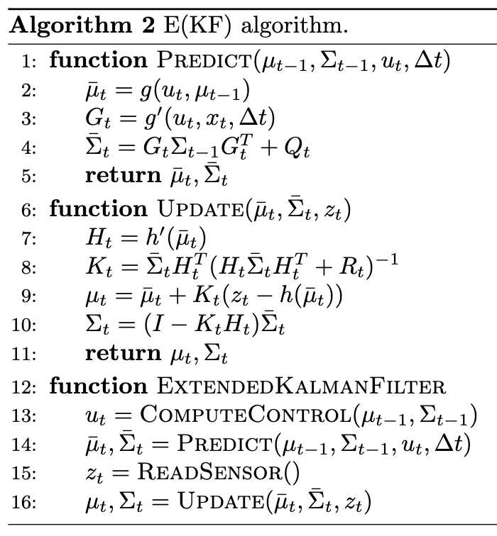
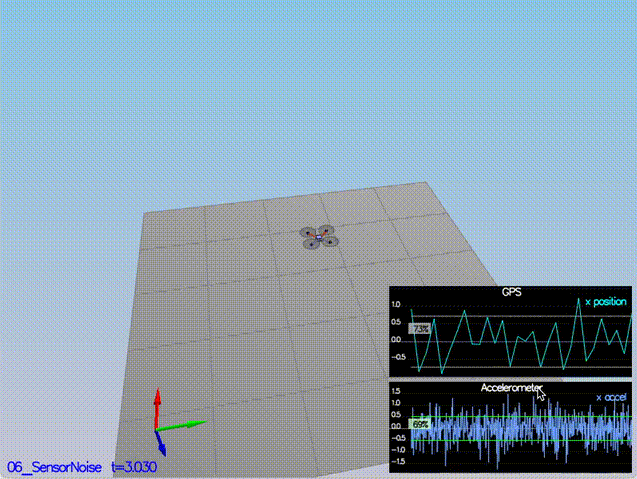
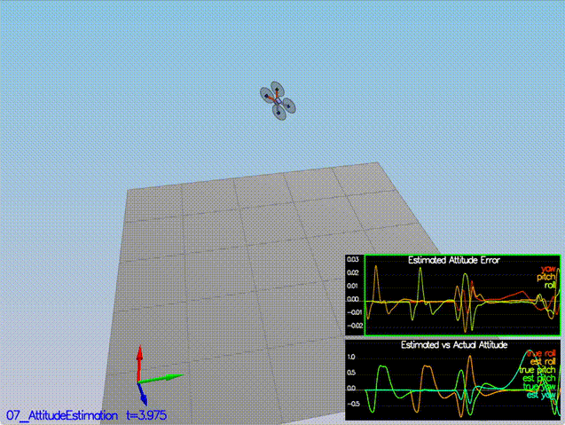
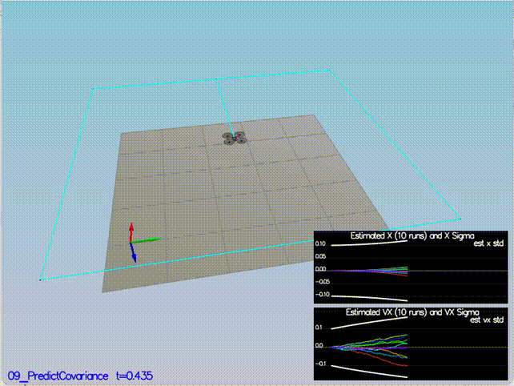

# Estimation Project #

## Introduction
This project focuses on creating the estimation component of the controller used in the CPP simulator, enhancing the realism and complexity of the simulation. Unlike the previous controls project, where the simulator operated with ideal, noise-free sensors, this phase introduces the challenge of working with noisy sensor data. This shift towards more realistic conditions is key to demonstrating the effectiveness of the custom controller and the estimator. In this project, the simulated quadcopter will navigate using the developed estimator and custom controller, offering a more authentic and practical demonstration of their capabilities in handling real-world, imperfect sensor information. The goal is to refine the estimator to accurately interpret and adapt to the sensor noise, ensuring reliable and stable flight dynamics in the simulator.

We'll be implementing the Extended Kalman Filter (EKF) in this project. EKF is the extension of the KF to the non-linear case. The equations implemented are from the paper [Estimation for Quadrotors](https://www.overleaf.com/read/vymfngphcccj). 

**Video of the simulation**

## Setup
- Cloned the repo - https://github.com/udacity/FCND-Estimation-CPP.git
- Imported the code into the Xcode IDE like done in the previous Controls C++ project
- Note that the files `QuadController.cpp` and `QuadControlParams.txt` have the boiler plate code and need to replaced for the last simulation scenario from the previous controls project.
- The EKF is already partially implemented for we in `QuadEstimatorEKF.cpp`. Parameters for tuning the EKF are in the parameter file `QuadEstimatorEKF.txt`.

**Kalman Filter Operations**:
- **State Prediction** (`PredictState`): Utilizes the current state, body rates from gyroscope, and body-frame accelerations to predict the next state using basic physics and quaternion transformations.
- **Measurement Updates** (`UpdateFromGPS`, `UpdateFromMag`, `UpdateFromIMU`): These methods handle the incorporation of GPS, Magnetometer and IMU measurements into the state estimate. The updates adjust the state estimate and covariance based on the differences between predicted states and measurements, using the respective measurement noise covariances.
- Generic Update Function (Update): This function performs the actual update of the EKF. It computes the Kalman gain, updates the state estimate and the covariance matrix based on the new measurement.

In the context of the **Extended Kalman Filter (EKF)** used for the quad, the `QUAD_EKF_NUM_STATES` variable being set to 7 suggests that the state vector, ekfState, is made up of 7 different elements. Each element of this state vector represents a specific aspect of the quadrotor's condition or position in space. Here’s what these 7 state variables represent:

- Position in the X-direction (x)
- Position in the Y-direction (y)
- Position in the Z-direction (z)
- Velocity in the X-direction (vx)
- Velocity in the Y-direction (vy)
- Velocity in the Z-direction (vz)
- Yaw (yaw)

## Tasks
- Figure out the standard deviation of the the GPS X signal and the IMU Accelerometer X signal from the log files.
- Implemented a better rate gyro attitude integration scheme to reduce attitude errors using the function `UpdateFromIMU()` in `QuadEstimatorEKF.cpp` that contains a complementary filter-type attitude filter.
- Implemented the state prediction step in the `PredictState()` functon in `QuadEstimatorEKF.cpp`.
- Calculated the partial derivative of the body-to-global rotation matrix in the function GetRbgPrime() in `QuadEstimatorEKF.cpp`.
- Implemented the rest of the prediction step (predict the state covariance forward) in `Predict()`.
- Tuned the `QPosXYStd` and the `QVelXYStd` process parameters in `QuadEstimatorEKF.txt`.
- Tuned the parameter `QYawStd` (QuadEstimatorEKF.txt) for the QuadEstimatorEKF so that it approximately captures the magnitude of the drift.
- Implemented magnetometer update in the function `UpdateFromMag()`.
- Tuned the process noise model in `QuadEstimatorEKF.txt` to try to approximately capture the error with the estimated uncertainty (standard deviation) of the filter.
- Implemented the EKF GPS Update in the function `UpdateFromGPS()`.
- Replaced the files `QuadController.cpp` and `QuadControlParams.txt` from previous controls project.
- Re-tuned the position and velocity gains to stabilise the flight.

## Flight Evaluation

### Scenario 6: Sensor Noise

- The goal is to collect some simulated noisy sensor data and estimate the standard deviation of the quad's sensor.
- When we run the scenario `06_NoisySensors`, the graphs we see will be recorded to the following csv files with headers: `config/log/Graph1.txt` (GPS X data) and `config/log/Graph2.txt` (Accelerometer X data).
- Processed the logged files to figure out the standard deviation of the the GPS X signal and the IMU Accelerometer X signal. This was done manually using a spreadsheet software. Updated these values in `config/6_Sensornoise.txt` for `MeasuredStdDev_GPSPosXY` and `MeasuredStdDev_AccelXY`.

Result:
- PASS: ABS(Quad.GPS.X-Quad.Pos.X) was less than MeasuredStdDev_GPSPosXY for 68% of the time
- PASS: ABS(Quad.IMU.AX-0.000000) was less than MeasuredStdDev_AccelXY for 69% of the time

### Scenario 7: Attitude Estimation

In this step, we will be improving the complementary filter-type attitude filter with a better rate gyro attitude integration scheme.

- For this simulation, the only sensor used is the IMU where `Quad.Sensors = SimIMU` and noise levels are set using `SimIMU.AccelStd` and `SimIMU.GyroStd` to 0.  There are two plots visible in this simulation. The top graph is showing errors in each of the estimated Euler angles. The bottom shows the true Euler angles and the estimates.
- In `QuadEstimatorEKF.cpp`, the function `UpdateFromIMU()` contains a complementary filter-type attitude filter. To reduce the errors in the estimated attitude (Euler Angles), a better rate gyro attitude integration scheme using the improved nonlinear scheme is implemented.

Result:
- PASS: ABS(Quad.Est.E.MaxEuler) attitude estimator was less than 0.100000 for at least 3.000000 seconds for each of the Euler angles

### Scenario 8: Prediction Step

- In this next step the prediction step of the filter was implemented.
- This scenario is configured to use a perfect IMU (only an IMU) with `Quad.Sensors = SimIMU`.
- Due to the sensitivity of double-integration to attitude errors, the accelerometer update is made very insignificant (`QuadEstimatorEKF.attitudeTau = 100`) by giving all weightage to the high pass filter. The plots on this simulation show element of the estimated state and that of the true state.
- In `QuadEstimatorEKF.cpp`, state prediction step is implemented in the `PredictState()` function. 

Result:
- The quad was able to traverse the square reference trajectory.
- This step doesn't have any specific measurable criteria.

### Scenario 9: Prediction Step with realistic IMU

- This scenario use a realistic IMU, one with noise. So `SimIMU.AccelStd`and `SimIMU.GyroStd` are not initialized to zero.
- There are two plots - The top graph shows 10 (prediction-only) position X estimates. The bottom graph shows 10 (prediction-only) velocity estimates.
- In `QuadEstimatorEKF.cpp`, calculated the partial derivative of the body-to-global rotation matrix in the function `GetRbgPrime()`.
- Implemented the rest of the prediction step in `Predict()`.
- Ran the covariance prediction and tuned the `QPosXYStd` and the `QVelXYStd` process parameters in `QuadEstimatorEKF.txt` to try to capture the magnitude of the error.

Result:
- Successfully capture the magnitude of the errors for both position and velocity errors within the white lines (covariance).
- This step doesn't have any specific measurable criteria.

### Scenario 10: Magnetometer Update

- Up until now we've only used the accelerometer and gyro for our state estimation.
- In this scenario, added the information from the magnetometer `Quad.Sensors = SimIMU, SimMag` to improve the filter's performance in estimating the vehicle's heading.
- Tuned the parameter `QYawStd` (`QuadEstimatorEKF.txt`) for the QuadEstimatorEKF so that it approximately captures the magnitude of the drift.
- Implemented magnetometer update in the function `UpdateFromMag()`.
- Re-Tuned the parameter `QYawStd` to better balance between the long term drift and short-time noise from the magnetometer.

Result:
- PASS: ABS(Quad.Est.E.Yaw) was less than 0.120000 rad in heading for at least 10.000000 seconds
- PASS: ABS(Quad.Est.E.Yaw-0.000000) was less than Quad.Est.S.Yaw for 79% of the time

### Scenario 11a: Closed Loop + GPS Update ###

This scenario uses both an ideal & realistic IMU and uses the additional GPS sensor with `Quad.Sensors = SimIMU, SimMag, SimGPS`.

Ideal IMU:
- Ran the scenario with `Quad.UseIdealEstimator` set to 1 in `config/11_GPSUpdate.txt` and `SimIMU.AccelStd` and `SimIMU.GyroStd` params initialized to 0.

Realistic IMU:
- Ran the scenario with `Quad.UseIdealEstimator` set to 0 in `config/11_GPSUpdate.txt` and commented out `SimIMU.AccelStd` and `SimIMU.GyroStd` params.
- Tuned the process noise model in `QuadEstimatorEKF.txt` to try to approximately capture the error with the estimated uncertainty (standard deviation) of the filter.
- Implemented the EKF GPS Update in the function `UpdateFromGPS()`.
- Re-ran the simulation.

Result:
PASS: ABS(Quad.Est.E.Pos) estimated position error was less than 1.000000 m for at least 20.000000 seconds

### Scenario 11b: Adding the Controller

- Up to this point, we have been working with a controller that has been relaxed to work with an estimated state instead of a real state.  So the objective now is to see how the controller performs and de-tune the controller accordingly.
- Replaced `QuadController.cpp` with the code developed from the controls project.
- Replaced `QuadControlParams.txt` with the control parameters tuned from the controls project.
- The position `kpPosXY, kpPosZ, KiPosZ` and `kpVelXY, kpVelZ` velocity gains were de-tuned to stabilize the quad. The de-tuning was done in a 2-step process, first under ideal sensors, then under realistic sensors.

Result:
PASS: ABS(Quad.Est.E.Pos) estimated position error was less than 1.000000 m for at least 20.000000 seconds

## Conclusion

The simulated quadcopter was able to successfully navigate the trajectories using the developed estimator and custom controller.